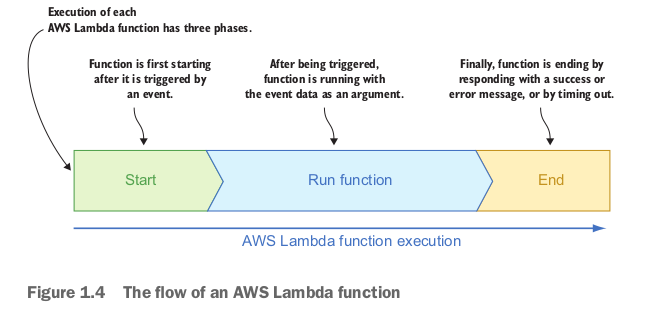
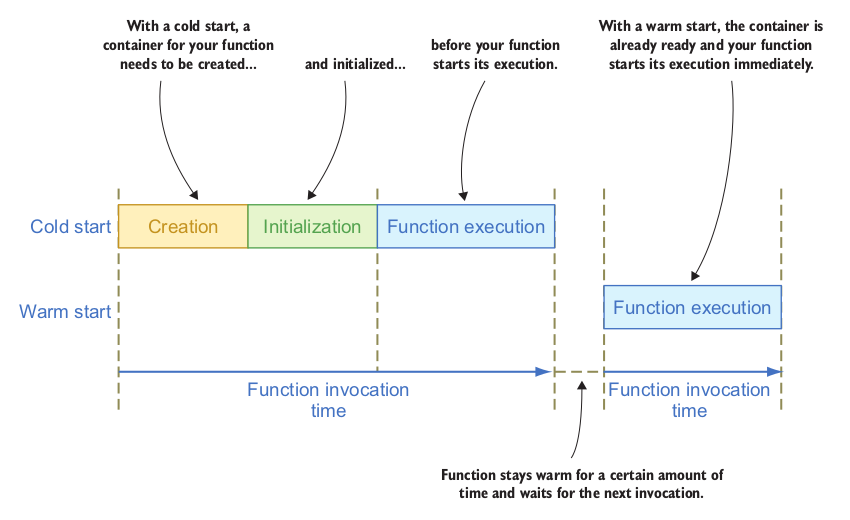

# Cloudformation
- A stack can be thought of as a collection of resources, along with a list of events associated with changes to those resources an the stack itself
- Note: the additional tags in the aws:cloudformation namespace, it will help keep track of its stack
## Command line to create cloudformation
```bash
aws cloudformation create-stack --template-body file://example-stack.json --stack-name example-stack
---
9c9,10
4a5,10
<
"Tags": [
<
{
<
"Value": "bar",
<
"Key": "foo"
<
}
<
],
```

## Command line to get change in template of cloudformation
```bash
aws cloudformation get-template --stack-name example-stack \
| grep -v "TemplateBody" | head -n -1 > example-stack.running

diff <(jq '.' example-stack.running) <(jq '.' example-stack.json)
```

## Command line to track down events in cloudformation
```bash
aws cloudformation describe-stack-events --stack-name example-stack --output text

aws cloudformation describe-stack-resources --stack-name example-stack --output text

aws ec2 describe-tags --filters Name=resource-type,Values=instance Name=resource-type,Values=i-xxx --output text
```

## Command line to update stack
```bash
aws cloudformation update-stack --template-body file://example-stack.json --stack-name example-stack --output text
---
arn:aws:cloudformation:us-east-1:xxx:stack/example-stack/xxx
```

## Command line to delete stack
```bash
aws cloudformation delete-stack --stack-name example-stack
```

## The building blocks of serverless application 
- Computing - `Lambda` - Computing component, used for your business logic
- Router - `Router` - Router component, used for route HTTP request data to Lambda function
- Database - `DynamoDB` - Autoscale document database
- Storage - `S3` - Autoscale file storage service` 

## Serverless flow

- Note:
    - Cold start: when first request is executed
    - Warm start: when reusing container to execute request


## Pseudo parameters
- AWS::AccountId
- AWS::NotificationARNs
- AWS::NoValue
- AWS::Region
- AWS::StackId
- AWS::StackName
- AWS::URLSuffix
- AWS::Partition

## AWS-specific parameter type:
- AWS::EC2::AvailabilityZone::Name
- AWS::EC2::Image::Id
- AWS::EC2::Instance::Id
- AWS::EC2::KeyPair::KeyName
- AWS::EC2::VPC::Id
- AWS::EC2::Subnet::Id

## AWS services consist of 3 parts
- ## API
- ## Backend
- ## Storage

### Examples
- Create an EC2 instance with: ec2:RunInstances
- Create stack in cloudformation with: cloudformation:CreateStack 
    - -> validate it -> start creating resources 
    - if creating resource failed -> rollback and delete resources, that were created before the failure
- Make change with: cloudformation:UpdateStack

## Drift dectection
- Cloudformation refers to state. This state contains a pair of values
    - The logical resource name (name in template)
    - The physical resource ID
- Enables you to detect whether a stack actual configuration diffes or has drifted
- Default value: `Drift state: NOT_CHECKED`
- If it has drifted:
    - Rollback change
    - Update stack

## Metadata section
    - AWS::CloudFormation::Init
    - AWS::CloudFormation::Interface
    - AWS::CloudFormation::Designer

## Parameters section
- The most important, it allows us to make our reusable template
- For example: CIDR of VPC and subnets, instance types of EC2 and RDS instance
```yaml
Parameters:
    InstanceType:
        Type: String
Resources:
    Ec2Instance:
        Type: AWS::EC2::Instance
        Properties:
            InstanceType: !Ref InstanceType
```

## How to use AllowedValues
```yaml
Parameters:
    Environment:
        Type: String
        AllowedValues: [dev, test, prod]
```

## How to use AllowedPattern
```yaml
Parameters:
    SubnetCIDR:
        Type: String
        AllowedPattern: '((\d{1,3})\.){3}\d{1,3}/\d{1,2}'
```
## How to set default value
```yaml
Parameters:
    DockerImageVersion:
        Type: String
        Default: latest
```
## How to use mappings functions (Fn::FindInMap)
```yaml
Mappings:
    RegionMap:
        us-east-1:
            HVM64: ami-0ff8a91507f77f867
            HVMG2: ami-0a584ac55a7631c0c
        us-west-1:
            HVM64: ami-0bdb828fd58c52235
            HVMG2: ami-066ee5fd4a9ef77f1
        eu-west-1:
            HVM64: ami-047bb4163c506cd98
            HVMG2: ami-0a7c483d527806435
        ap-northeast-1:
            HVM64: ami-06cd52961ce9f0d85
            HVMG2: ami-053cdd503598e4a9d
        ap-southeast-1:
            HVM64: ami-08569b978cc4dfa10
            HVMG2: ami-0be9df32ae9f92309
Resources:
    Ec2Instance:
        Type: "AWS::EC2::Instance"
        Properties:
            ImageId: !FindInMap [RegionMap, !Ref "AWS::Region", HVM64]
```
## How to use condition
- 2 values: true or false
- Functions:
    - Fn::Equals
    - Fn::If
    - Fn::Not
    - Fn::And
    - Fn::Or
```yaml
AWSTemplateFormatVersion: '2010-09-09'
Parameters:
    Env:
        Default: dev
        Description: Define the environment (dev, test or prod)
        Type: String
        AllowedValues: [dev, test, prod]
Conditions:
    IsProd: !Equals [!Ref Env, 'prod']
Resources:
    Bucket:
        Type: "AWS::S3::Bucket"
        Condition: IsProd
```
- If Env == true => creating S3

## Resources section
- This is main block, resources has multiple attributes
    - Type: the type of resource
    - Properties: configuration of the resource
    - DependsOn: used for adding indirect dependencies
    - CreationPolicy:
    - DeletionPolicy: used for important resources
        - `DeletionPolicy: EnableTerminationProtection`: fail to delete resource
        - `DeletionPolicy: Snapshot` => create snapshot before delete it
        - `DeletionPolicy: Retain` => remove from cloudformation's state, but resource will stay in our account
    - UpdatePolicy: 
    - Output: the values we export

## Cidr function
- ipBlock: CIDR range
- count: how many CIDR ranges we want to generate
- cidrBits: CFN which ranges to generate
- Example: `!Cidr [ !Ref VpcCidr, 9, 8]`
    - VpcCidr: 10.0.0.0/16
    - Create 9 subnet with format: 10.0.x.0/24

## Select function
- using to choose a value following index
- Example: `!Select [0, !Cidr [ !Ref VpcCidr, 9, 8]]` => 10.0.1.0/24

## ImportValue function
- look up the neccessary attribute in the CloudFormation exported values across the whole account within a region and write a necessary entry to the resource attribute 
- ### core.yaml
```yaml
Parameters:
# ...
Resources:
    Vpc:
        Type: AWS::EC2::VPC
        Properties:
        # ...

    PublicSubnet1:
        Type: AWS::EC2::Subnet
        Properties:
        # ...
    # The rest of our resources...

Outputs:
    VpcId:
        Value: !Ref Vpc
        Export:
            Name: Vpc
    PublicSubnet1Id:
        Value: !Ref PublicSubnet1
        Export:
            Name: PublicSubnet1Id
    PublicSubnet2Id:
        Value: !Ref PublicSubnet2
        Export:
            Name: PublicSubnet2Id
    PublicSubnet3Id:
        Value: !Ref PublicSubnet3
        Export:
            Name: PublicSubnet3Id
```
Or
```yaml
Outputs:
    PublicSubnetIds:
        Value: !Split [",", !Join [",", [!Ref PublicSubnet1, !Ref PublicSubnet2, !Ref PublicSubnet3] ] ]
        Export:
            Name: PublicSubnetIds
```
- ### webtier.yaml
```yaml
Resources:
    WebTierAsg:
        Type: AWS::AutoScaling::AutoScalingGroup
        Properties:
            # Some properties...
    VpcZoneIdentifier:
        - !ImportValue PublicSubnet1Id
        - !ImportValue PublicSubnet2Id
        - !ImportValue PublicSubnet3Id
```
Or
```yaml
Resoures:
    WebTierAsg:
        Type: AWS::AutoScaling::AutoScalingGroup
        Properties:
            # Some properties
            VpcZoneIdentifier: !ImportValuePublicSubnetIds
```
- ### Database.yaml
```yaml
Outputs:
    DbEndpoint:
        Value: !If [ ProdEnv, !GetAttProdDatabase.Endpoint.Address, !If [ TestEnv, !GetAttTestDatabase.Endpoint.Address,!GetAtt.DevDatabase.Endpoint.Address ]]
    Export:
        Name: DbEndpoint
```