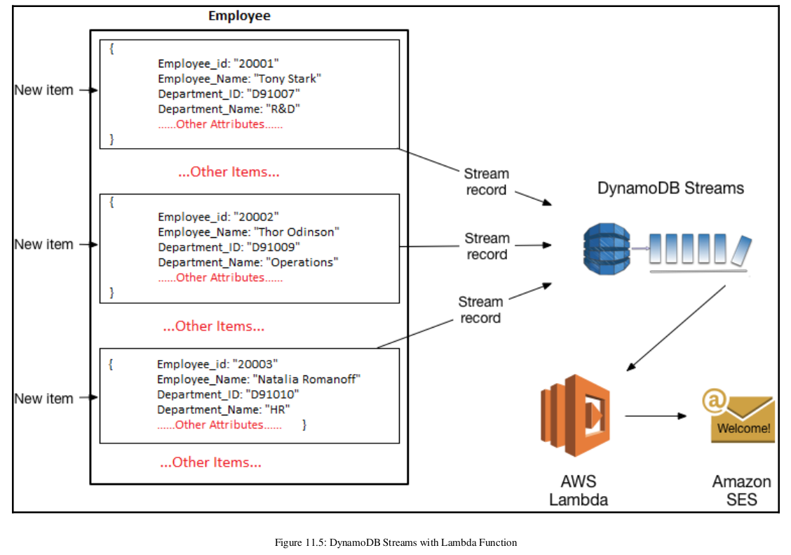
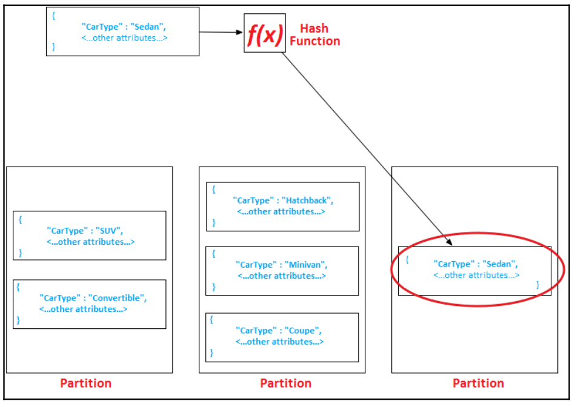

# Dynamo database 

## DynamoDB components
- Tables: consists of a set of data
- Item: a table consists of multiple item, alike key-value pair
- Attributes: an item in a table consists of multiple attributes

## Primary key has 2 types:
- Partion key (hash key) => `simple primary key`: which determines in which partition the data is stored. Such as: employee_id
- Partition key and sort key (range key) => `composite primary key`: determines the place of an item in a partion
- DynamoDB stores all items with the same partion key together. In a partition, items are order based on a sort key value

## Secondary indexes in a table
- It is an alternate way to query table data using the primary key
- Consists of 2 type:
    - Global secondary indexes (GSI): partition key and sort key different from the primary keys defined on the table
    - Local secondary index (LSI): the same partition key as of the table but uses a different sort key
    - Limit 5 GSI and 5 LSI on a table

## DynamoDB stream, trigger when database changed (update, delete, add)

## Setup read consistency model with `ConsistentRead` parameter
- Set `true` if DynamoDB uses strongly consistent reads
- Set `false` if DynamoDB uses eventually consistent reads

## DynamoDB partition and data distribution
- Table partitioning is a mechanism to segregate a large table into smaller, more manageable parts without creating a separate table for each part.
- DynamoDB manages data in partitions and uses SSD to storing data and automatically replicates data across multiple AZs in an AWS region

## Data distribution with partition key and sort key
- Using partition key for determining target partition, where data is stored
- DynamoDB orders the data by the sort key value

## Note:
- GSIs are also segregated in partitions 
- The data in an index is stored separately from the base data of a table
- Index partitions and table partitions act in a similar manner in DynamoDB
- The best way to optimize partitioning is to use more distint values such as: COFFEE01, COFFEE02, ...

## Secondary index 
- Main purpose is to provide an alternative key for query operations
- The secondary index is linked with a table, which becomes the source of data for it
- When you change anything on the base table, the change automatically reflects into indexs such as: add, modify, delete item in the table 

### Global secondary index (GSI)
- Different partition key and sort key from base table
- When any request is executed against a GSI, its scope spans across all the partition in a table 
- Simple attribute primary key or composite key
- There is no restriction on the size of the index
- Only support eventual consistency reads

### Local secondary index (LSI)
- The same partition key as its base table => mapping between index and base table. It has a different sort key 
- Only can composite key and query a single partition with a partition key value specified in the query
- Each partion size < 10GB
- Support both strongly and eventual consistency reads 
