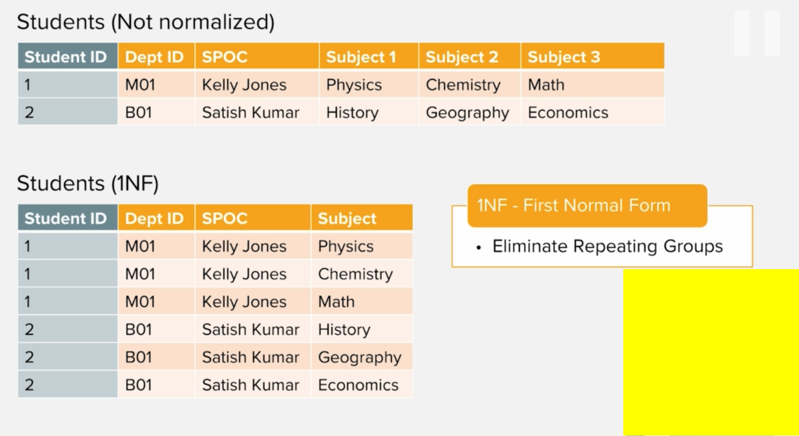
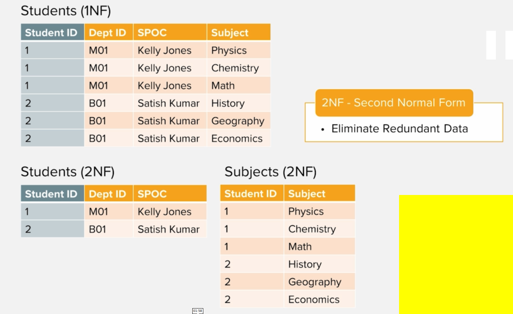
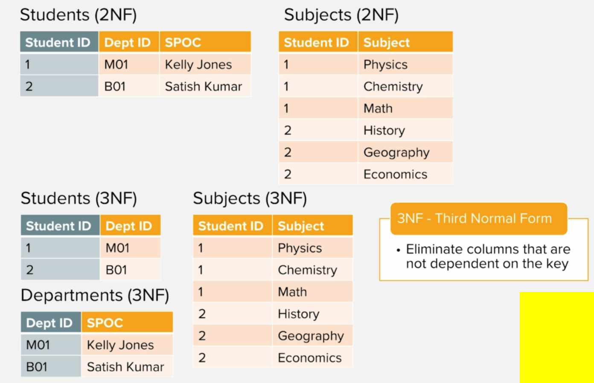

# Data normalization in RDMS

## Benefits
- ### Efficiently organize data
- ### Eliminate redundant data

## Normalization forms
- ### `1NF`: eliminates repeating groups

- ### `2NF`: eliminates redundant data

- ### `3NF`: eliminates columns that are not dependent on key
