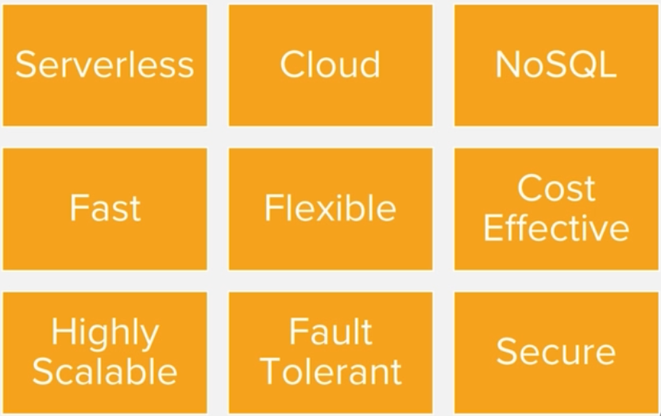
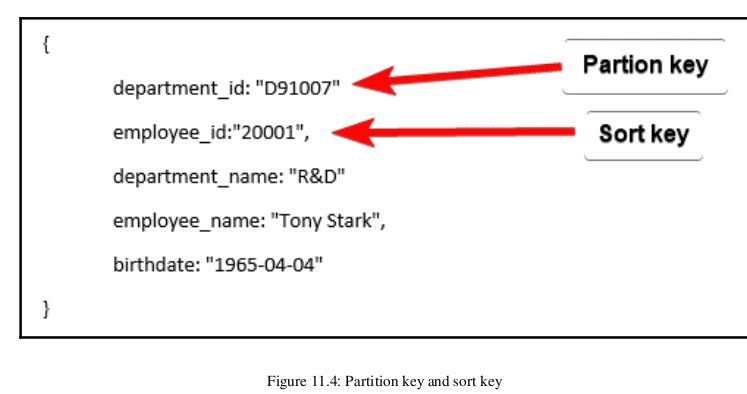
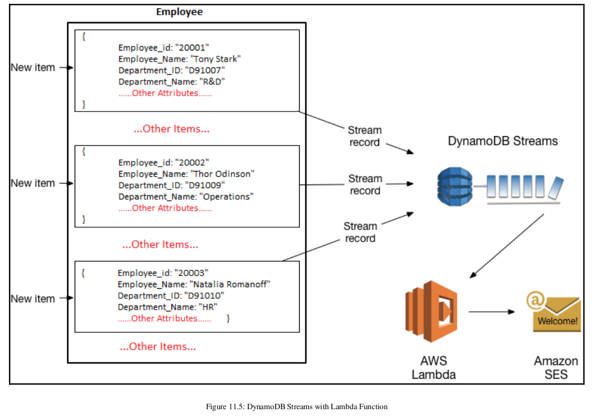
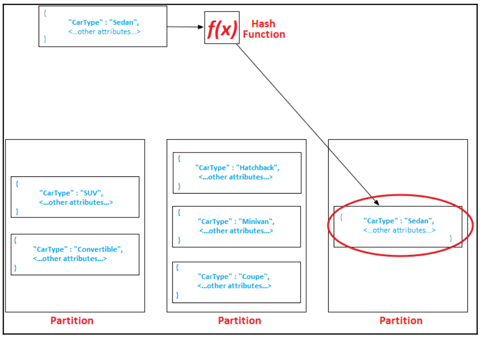
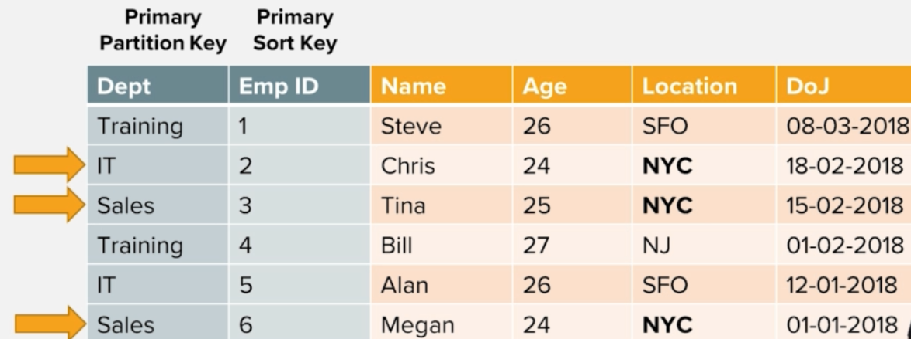
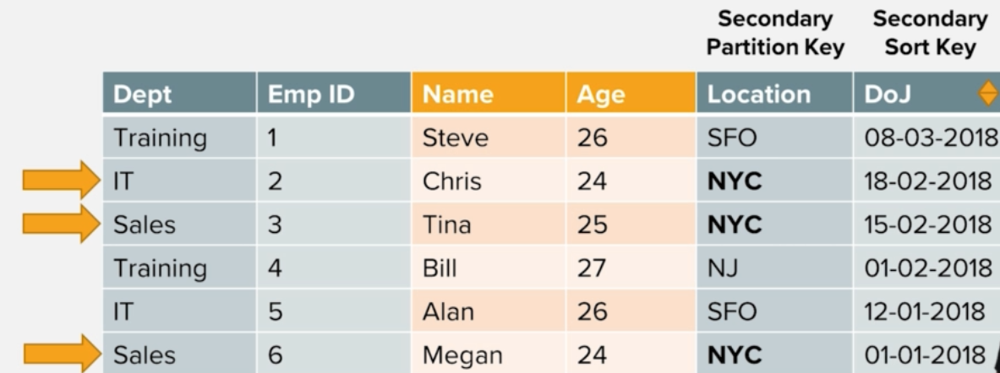
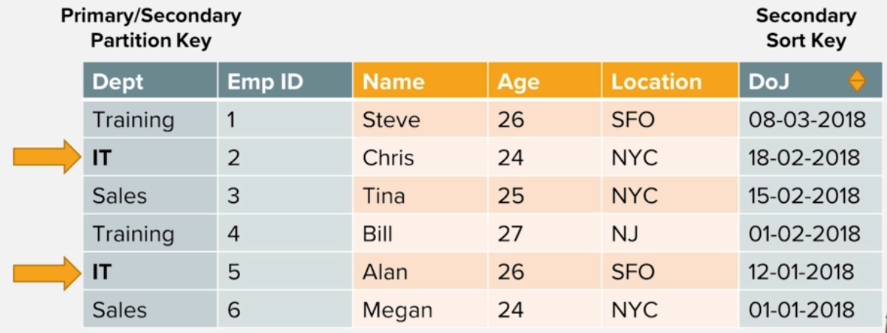

# DynamoDB
- ### Fully managed cloud database
- ### Seamless on-demand scaling
- ### Unlimited concurrent `Read/Write operations`
- ### Single-digit milisecond latency (< 10 ms)
- ### Sub-microsecond latency with `DAX`



## DynamoDB components
- Tables: consists of a set of data
- Item: a table consists of multiple item, alike key-value pair
- Attributes: an item in a table consists of multiple attributes

## Primary key has 2 types:
- Partion key (hash key) => `simple primary key`: which determines in which partition the data is stored. Such as: employee_id
- Partition key and sort key (range key) => `composite primary key`: determines the place of an item in a partition
- DynamoDB stores all items with the same partion key together. In a partition, items are order based on a sort key value


## Secondary indexes in a table
- It is an alternate way to query table data using the primary key
- Consists of 2 type:
    - Global secondary indexes (GSI): partition key and sort key different from the primary keys defined on the table
    - Local secondary index (LSI): the same partition key as of the table but uses a different sort key
    - Limit 5 GSI and 5 LSI on a table

## Dynamodb tables
- ### Top level entities
- ### Independent entities 
- ### Flexible schema
- ### Control performance at the table level with RCU and WCU

## DynamoDB naming conventions
- ### Prefix table name to create namespaces
- ### `prefix.tablename` or `prefix_tablename` such as: test.users, test_projects
- ### Best practice

## Types of dynamodb
- ### String, number, binary, boolean (true/false), null (unknown or undefined state)
- ### Set such as ["red", "blue", "green"]
- ### Document (List, Map) such as: ["John", 22, "male"]
```json
{
    "username": "example",
    "password": "pwd"
}
```

## Table index 
- ### Mandatory primary key => either simple or composite
- ### Simple primary key => only partion or hash key
- ### Composite primary key => partition key + sort or range key
- ### Partition or hash key decides the target partition

## DynamoDB stream, trigger when database changed (update, delete, add)


## Setup read consistency model with `ConsistentRead` parameter
- Set `true` if DynamoDB uses strongly consistent reads
- Set `false` if DynamoDB uses eventually consistent reads

## DynamoDB partition and data distribution
- Table partitioning is a mechanism to segregate a large table into smaller, more manageable parts without creating a separate table for each part.
- DynamoDB manages data in partitions and uses SSD to storing data and automatically replicates data across multiple AZs in an AWS region



## Data distribution with partition key and sort key
- Using partition key for determining target partition, where data is stored
- DynamoDB orders the data by the sort key value

## Note:
- GSIs are also segregated in partitions 
- The data in an index is stored separately from the base data of a table
- `Index partitions` and `table partitions` act in a similar manner in DynamoDB
- The best way to optimize partitioning is to use more distint values such as: COFFEE01, COFFEE02, ...

## Secondary index 
- Main purpose is to `provide an alternative key for query operations`
- The secondary index is linked with a table, which becomes the source of data for it
- `When you change anything on the base table, the change automatically reflects into indexs` such as: add, modify, delete item in the table 


### Global secondary index (GSI)
- `Different partition key and sort key` from base table
- When any request is executed against a GSI, its scope spans across all the partition in a table 
- `Simple attribute primary key` or `composite key`
- There is no restriction on the size of the index
- `Only support eventual consistency reads`


### Local secondary index (LSI)
- The `same partition key` as its base table => mapping between index and base table. It has a `different sort key` 
- Only can composite key and query a single partition with a partition key value specified in the query
- `Each partion size < 10GB`
- `Support both strongly and eventual consistency reads`


## Integration


## For example, connecting `DynamoDB` by aws-sdk
```text
const AWS = require("aws-sdk");
AWS.config.update({ region: 'us-west-2' });

const dynamodb = new AWS.DynamoDB();

dynamodb.listTables((err, data)=>{
    if(err) {
        console.log(err);
    } else {
        console.log(data);
    }
});
```
