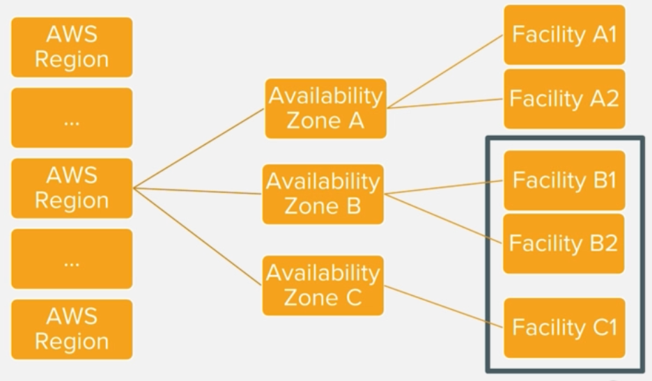
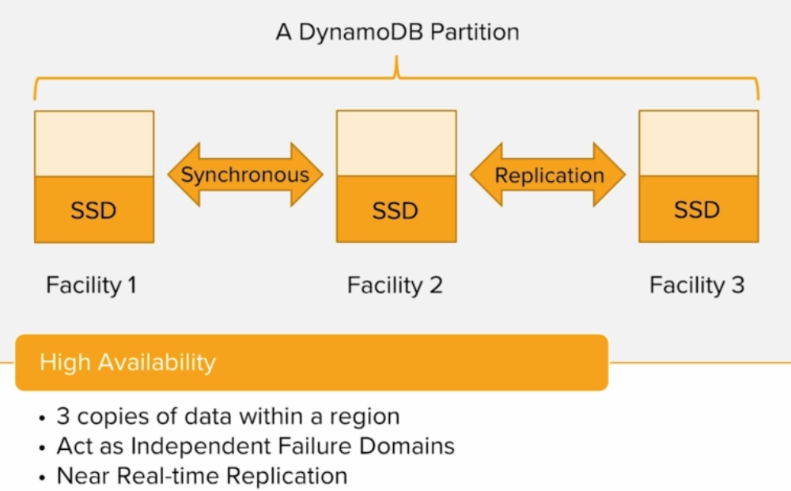
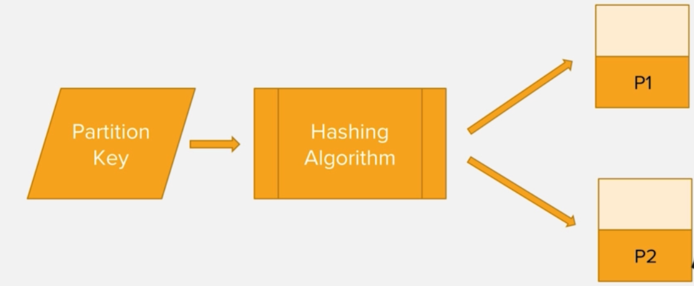

# DynamoDB infrastructure

## AWS infrastructure


## Automatic synchronous replication


## DynamoDB partitions
- ### A table can have multiple partitions
- ### Num of table partitions depend on its size and provisioned capacity 
- ### `1 partition = 10GB data`
- ### `1 partition = 1000 RCUs or 3000 RCUs`
- ### For example 
```text
- Provisioned capacity: 500 RCU and 500 WCU

P = (500 RCU / 3000) + (500 WCU / 1000) = 0.67 ~ 1 partition

- Provisioned capacity: 1000 RCU and 1000 WCU

P = (1000 RCU / 3000) + (1000 WCU / 1000) = 1.33 ~ 2 partition
```

## Hashing in dynamodb
