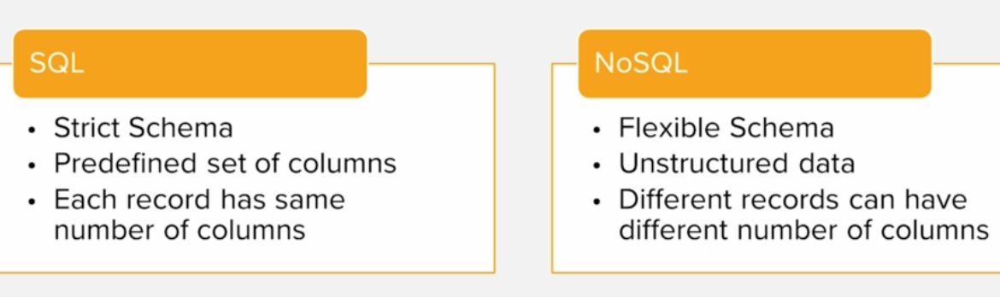
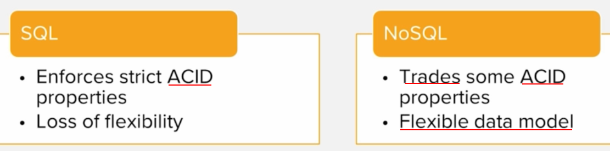
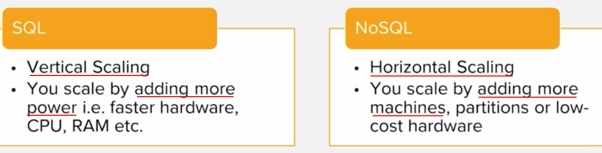
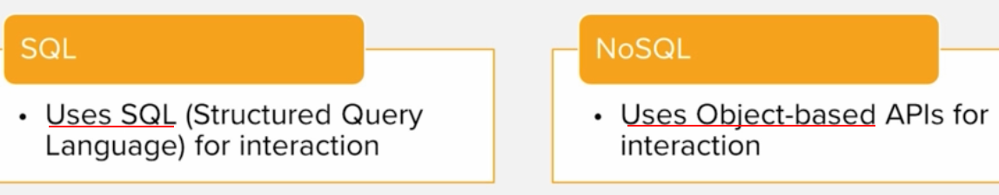

# Comparing SQS and NoSQL

## Why NoSQL
- ### RD not suited for unstructured data
- ### RD not suited for big data applications
- ### Big data means huge volumes of data or high frequency data

## Overview NoSQL
- ### Not-Only-SQL
- ### Non-relational is nature
- ### Support unstructured data
- ### Well suited for big data application (volume + velocity + variety)

## Types of NoSQL databases
- ### Columnar database
- ### Key-Value store
- ### Graph database
- ### Document database

## Comparing about data model

## Comparing about ACID behaviour

## Comparing about scaling

## Comparing about interaction APIs
