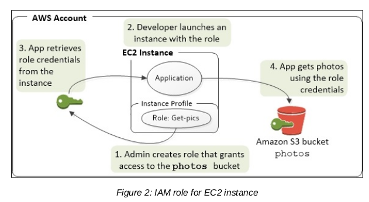
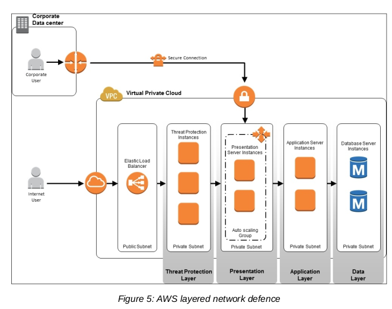

# Elastic compute cloud (ec2)
- An instance can be thought of as a virtual server
- Amazon Machin Image (AMI) are the main building block of EC2
- Each availability region (AZ) is located in a physically seperate datacenter within its region
- Instance type differ in the amount of resources allocated to them such as
    - m3.medium: 3.75 GB of memory, 1 vCPU
    - c3.8xlarge: 60GB of memory, 32vCPU
    - General purpose (M4, M3)
    - Burstable performance (T2)
    - Compute optimized (C4, C3)
    - Memory intensive (R3)
    - Storage optimized (I2 for performance, D2 for cost)
    - GPU enabled (G2)

## Storage
- Consists of 2 types;
    - Instance storage: is attached directly to the physical host that runs your instance
    - Elastic Block Storage: is attached over the network, create snapshot
    => Effect disk latency and throughput

## EC2 security
- IAM roles for EC2
- Managing OS-level access to EC2 instances
- Protecting the system from malware
- Securing your infrastructure
- Intrusion detection and prevention systems
- Elastic load balancing security
- Building threat protection layers
- Test security
    - External vulnerability assessement
    - External penetration tests
    - Internal white-box review for apps
    - Penetration testing process 

### NACL and security group is 2 firewall provided for subnet ands instances

### AWS Shield is a managed DDoS protection service

## EC2 security best practices
- Least access, privilege such as using role-based access for instances
- Configuration management and change management
- Audit logs use CloudTrail, VPC flow logs 
- Network access:
    - Allow minimum traffic to instances with security group. For example: HTTP and HTTPS traffic
    - Using NACL to deny traffic from unwanted sources
    - Config route tables for the subnets 
- Create role for applications to access AWS services such as: S3, SQS, SNS, ...
- Data encryption use EBS and KMS, TLS or IPSec encryption protocols

## Using IAM roles to provide temporary credentials for access AWS resources

## Designing layered network defence
