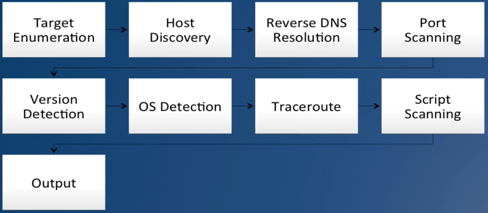

# Nmap tools

## Installing
```text
apt-get install nmap -y
```

## Reading tutorial
```text
man nmap
```

## Practise
- Scanning domain
```text
$ nmap scanme.nmap.org

Starting Nmap 7.60 ( https://nmap.org ) at 2020-10-24 16:37 +07
Nmap scan report for scanme.nmap.org (45.33.32.156)
Host is up (0.19s latency).
Other addresses for scanme.nmap.org (not scanned): 2600:3c01::f03c:91ff:fe18:bb2f
Not shown: 996 closed ports
PORT      STATE SERVICE
22/tcp    open  ssh
80/tcp    open  http
9929/tcp  open  nping-echo
31337/tcp open  Elite
```

- Scanning subnet following the ports
```text
// list who are
$ nmap -p 80,443 192.168.1.0/24

Starting Nmap 7.60 ( https://nmap.org ) at 2020-10-24 16:40 +07
Nmap scan report for _gateway (192.168.1.1)
Host is up (0.00067s latency).

PORT    STATE SERVICE
80/tcp  open  http
443/tcp open  https

Nmap scan report for util4dev (192.168.1.30)
Host is up (0.00074s latency).

PORT    STATE  SERVICE
80/tcp  closed http
443/tcp closed https

Nmap scan report for 192.168.1.88
Host is up (0.13s latency).

PORT    STATE  SERVICE
80/tcp  closed http
443/tcp closed https

Nmap done: 256 IP addresses (3 hosts up) scanned in 2.70 seconds
```

- Scanning multiple ip
```text
$ nmap -Pn 192.168.1.1-10

Starting Nmap 7.60 ( https://nmap.org ) at 2020-10-24 16:48 +07
Nmap scan report for _gateway (192.168.1.1)
Host is up (0.00054s latency).
Not shown: 982 filtered ports
PORT      STATE  SERVICE
53/tcp    open   domain
80/tcp    open   http
443/tcp   open   https
49152/tcp open   unknown
49153/tcp closed unknown
49154/tcp closed unknown
49155/tcp closed unknown
49156/tcp closed unknown
49157/tcp closed unknown
49158/tcp closed unknown
49159/tcp closed unknown
49160/tcp closed unknown
49161/tcp closed unknown
49163/tcp closed unknown
49165/tcp closed unknown
49167/tcp closed unknown
49175/tcp closed unknown
49176/tcp closed unknown

Nmap scan report for 192.168.1.2
Host is up (0.074s latency).
All 1000 scanned ports on 192.168.1.2 are filtered

Nmap scan report for 192.168.1.3
Host is up (0.074s latency).
All 1000 scanned ports on 192.168.1.3 are filtered

Nmap scan report for 192.168.1.4
Host is up (0.074s latency).
All 1000 scanned ports on 192.168.1.4 are filtered

Nmap scan report for 192.168.1.5
Host is up (0.073s latency).
All 1000 scanned ports on 192.168.1.5 are filtered

Nmap scan report for 192.168.1.6
Host is up (0.073s latency).
All 1000 scanned ports on 192.168.1.6 are filtered

Nmap scan report for 192.168.1.7
Host is up (0.073s latency).
All 1000 scanned ports on 192.168.1.7 are filtered

Nmap scan report for 192.168.1.8
Host is up (0.074s latency).
All 1000 scanned ports on 192.168.1.8 are filtered

Nmap scan report for 192.168.1.9
Host is up (0.074s latency).
All 1000 scanned ports on 192.168.1.9 are filtered

Nmap scan report for 192.168.1.10
Host is up (0.074s latency).
All 1000 scanned ports on 192.168.1.10 are filtered

Nmap done: 10 IP addresses (10 hosts up) scanned in 65.85 seconds
```

- Scanning with file
```text
// targets.txt
scanme.nmap.org
192.168.1.1
192.168.1.2

// cli
$ nmap -iL targets.txt
```

- Scanning port and website
```text
$ nmap -p80 -sV scanme.nmap.org

Starting Nmap 7.60 ( https://nmap.org ) at 2020-10-24 16:54 +07
Nmap scan report for scanme.nmap.org (45.33.32.156)
Host is up (0.19s latency).
Other addresses for scanme.nmap.org (not scanned): 2600:3c01::f03c:91ff:fe18:bb2f

PORT   STATE SERVICE VERSION
80/tcp open  http    Apache httpd 2.4.7 ((Ubuntu))

Service detection performed. Please report any incorrect results at https://nmap.org/submit/ .
Nmap done: 1 IP address (1 host up) scanned in 7.97 seconds

```

- Scanning port and attached script 
```text
$ nmap -p80 --script=http-title scanme.nmap.org

Starting Nmap 7.60 ( https://nmap.org ) at 2020-10-24 17:05 +07
Nmap scan report for scanme.nmap.org (45.33.32.156)
Host is up (0.19s latency).
Other addresses for scanme.nmap.org (not scanned): 2600:3c01::f03c:91ff:fe18:bb2f

PORT   STATE SERVICE
80/tcp open  http
|_http-title: Go ahead and ScanMe!

Nmap done: 1 IP address (1 host up) scanned in 0.98 seconds
```

- Scanning port range
```text
$ nmap -p80-200 scanme.nmap.org

Starting Nmap 7.60 ( https://nmap.org ) at 2020-10-24 17:07 +07
Nmap scan report for scanme.nmap.org (45.33.32.156)
Host is up (0.19s latency).
Other addresses for scanme.nmap.org (not scanned): 2600:3c01::f03c:91ff:fe18:bb2f
Not shown: 120 closed ports
PORT   STATE SERVICE
80/tcp open  http

Nmap done: 1 IP address (1 host up) scanned in 1.03 seconds
```

##  Reading the Nmap output
- Understand the 6 port states that nmap might use
- How to read and analyze the results from nmap

| Port              | Description   |
| ---               | ---           |
| Open              | An app is accepting connections |
| Closed            | No app is using it |
| Filtered          | <ul><li>Nmap can't determine its state</li><li>Something is blocking access to the port </li><ul> |
| Unfiltered        | <ul><li>Open or closed state</li><li>Only show up when doing an ACK scan</li><li>Used to map firewall rule sets</li></ul>  |
| Open or filtered  | <ul><li>Open or filtered state</li><li>Port is open, but no response is received</li><li>Appears in UDP, IP protocol, FIN, Null and Xmas scans only</li></ul>  |
| Closed or filtered| <ul><li>Closed and filtered state</li><li>Appears only in idle scans</li></ul>| 

- Scanning router
```
$ nmap -oN wireless-router 192.168.1.1

Starting Nmap 7.60 ( https://nmap.org ) at 2020-12-05 23:35 +07
Nmap scan report for gateway (192.168.1.1)
Host is up (0.0016s latency).
Not shown: 982 filtered ports
PORT      STATE  SERVICE
53/tcp    open   domain
80/tcp    open   http
443/tcp   open   https
```

- Scanning server up in subnet
```
$ nmap -sP -oG ping-sweep-raw 192.168.1.0/24
```

- Scanning to out XXX format
```
$ nmap -oX xml-dump 192.168.1.1 192.168.1.236
$ nmap -oA full-data scanme.nmap.org
```

## Nmap scan phase


## Scanning with privileges
```
$ nmap -O 192.168.1.1

Starting Nmap 7.60 ( https://nmap.org ) at 2020-12-05 23:58 +07
Stats: 0:00:20 elapsed; 0 hosts completed (1 up), 1 undergoing SYN Stealth Scan
SYN Stealth Scan Timing: About 80.23% done; ETC: 23:59 (0:00:05 remaining)
Nmap scan report for gateway (192.168.1.1)
Host is up (0.00050s latency).
Not shown: 982 filtered ports
PORT      STATE  SERVICE
53/tcp    open   domain
80/tcp    open   http
443/tcp   open   https
MAC Address: (Unknown)
Device type: broadband router|general purpose
Running (JUST GUESSING): Zhone embedded (98%), Linux 2.6.X (90%), FreeBSD 6.X (89%)
OS CPE: cpe:/o:linux:linux_kernel:2.6.9 cpe:/o:freebsd:freebsd:6.2
Aggressive OS guesses: Zhone GPON home gateway (98%), Linux 2.6.9 (90%), FreeBSD 6.2-RELEASE (89%), Linux 2.6.9 - 2.6.27 (89%)
No exact OS matches for host (test conditions non-ideal).
Network Distance: 1 hop

OS detection performed. Please report any incorrect results at https://nmap.org/submit/ .
Nmap done: 1 IP address (1 host up) scanned in 27.97 seconds

```
