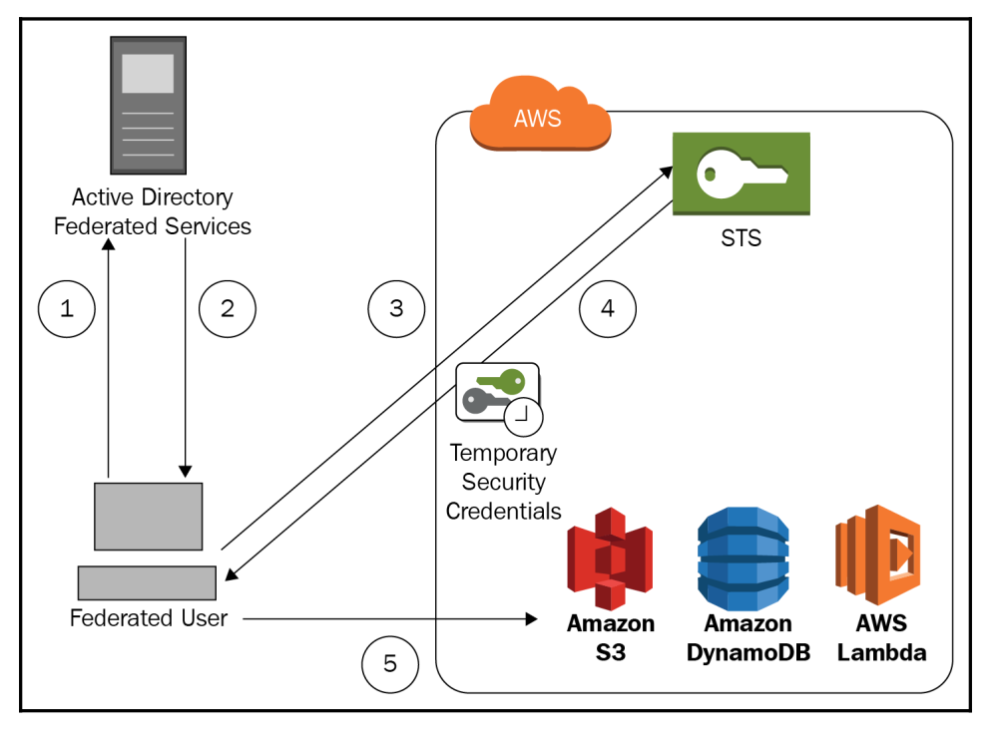

# Understanding access control
- Focus on IAM service
- Having a solid understanding of how AWS manages and implements access control for the AWS resources is essential if you want to pass the exam
- Security features heavily in the exam

## Authentication
- At a high level, when an identity has to gain accecss to a resource or environment such as user logging
- Authentication is a two-step process:
    - First, an identity
    - Then, verification of that identity

## Authorization
- Authorization describe what actions the authenticated identity can perform
- It's not possible to gain access to a resource without first passing an authentication barrier

## Access control
- How can manage, restrict and allow access the resources. There are different mechanism for achieving this within AWS
- IAM roles are another method of access control. By using roles, you are able to assume temporary credentials
### Authenticating via access control methods
- Username and password
- Multi-factor authentication
- Programmatic access to the resource through a range of SDKs and the AWS CLI. This is achieved through the use of access keys (access key and secret access key)
- Key pairs: diffrent access keys 
    - Access keys are used to verify and authenticate to AWS
    - Key pairs are used by EC2 instances to allow you to connect and authenticate to an instance
### IAM roles
- IAM roles are a great way to assign permissions to users, apps and other services
- Roles are assumed, they can be used to apply temporary credentials to an identity or service
- For example: EC2 need to read-only access to S3. When EC2 instance is associated with an IAM role, the instance has the permissions that are given to that role
```yaml
{
    "Version": "2012-10-17",
    "Statement": [
        {
            "Effect": "Allow",
            "Action": [
                "s3:Get*",
                "s3:List*"
            ],
            "Resource": "*"
        }
    ]
}
```
## Cross-account roles
- For examle, user in dev needs to temporarily access an RDS database in prod. The IAM administrator in prod can create a cross-account role, CrossAccountRoleRDS, to allow for the relevant access 
- To do this, the administrator has to add following permissions to the user or groups
```yaml
{
    "Version": "2012-10-17",
    "Statement": [
        {
            "Effect": "Allow",
            "Action": ["sts:AssumeRole"],
            "Resource": "arn:aws:iam::123456789012:role/CrossAccountRoleRDS"
        }
    ]
}
```

## Web identity and SAML federation
- It allow for entities to access your AWS resources temporarily, through the use of roles
### Federation of access: allowing you to authenticate an identity as a user such as facebook, google, ...
- Web identity federation
    - For example, allowing a mobile gaming app access to DynamoDB to pos their high scores and achievements
    - Can use Identity Providers (IdPs) sush as facebook, google, amazon. OpenID Connect (OIDC)
    - Amazon Cognito is often used as a link between the web IdP and your AWS resources, to control the authentication process. It can scale to millions of users
### SAML (Security Assertion Markup Language) 2.0 federation
- Authenticating your internal users to AWS using your own Microsoft Active Directory accounts with SAML 2.0
- Allowing you to enforce a single sign-on (SSO) approach for users, to prevent IAM Admin create hundreds of IAM accounts
- It enables the exchange of authentication tokens between 2 providers: IdP and service provider



## IAM authorization
- [Users](#users)
- [Groups](#groups)
- [Roles](#roles)
- [Identity-based policies](#policies)

### <h3 id="users">Users</h3>
- Permission policies can be assigned to a specific user, authorizing them to gain access to services and resources. Not best practise => assign to groups

### <h3 id="groups">Groups</h3>
- Groups are also objects. Users are associated to groups and these groups have associated permissions policies

### <h3 id="roles">Roles</h3>
- Roles allow an identity to assume a set of permissions

### <h3 id="policies">Identity-based policies</h3>
- Policy are used to define permissions that are associated to different entities, authorizing them to perform specific actions 
- Components consist of:
    - Version: best practise, you always use the latest version
    - Statement
        - Sid
        - Effect: `Allow` or `Deny` access
        - Action: `"Action": [ "ec2:AttachVolume", "ec2:DeleteVolume"]`
        - Resource: ARN
        - Condition: `"Condition": { "IpAddress": { "aws:SourceIp": "10.1.0.0/24" } }`