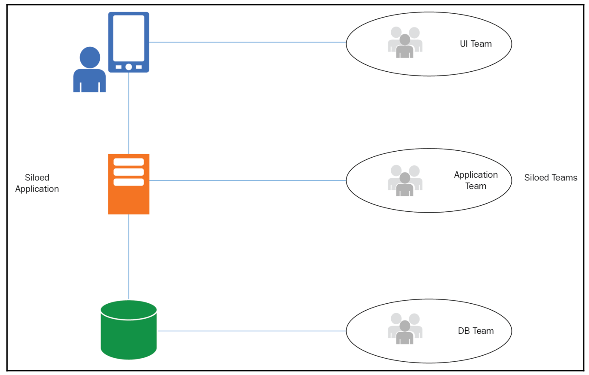

# Overview AWS
- Solution architecture is a discipline responsible for the non-functional requirements, and a model to design the <b>Quality of Service (QoS)</b> of the information systems
- Architecture is about finding the right balance and the midpoint of every circumstance
- SA is to evaluate several trade-offs, manage the essential complexity of things, their technical evolution, and the inherent entropy of complex systems

## Minimizing complexity
- Functional decomposition: breaking a complex system -> managable parts
- N-tier architecture: spliting big system into logical layers. Each layer focused on one responsibility
- Leveraging characteristics such as scalability, flexibility, reusability, ...

## Conway's law
```
Design system is copies of the communication structures of organization
```
### Traditional solution


### Cloud computing
- Cloud computing is a service model based on large pools of resources exposed through web interfaces, with objective being to provide sharable, elastic and secure services on demand with low cost and high flexibility