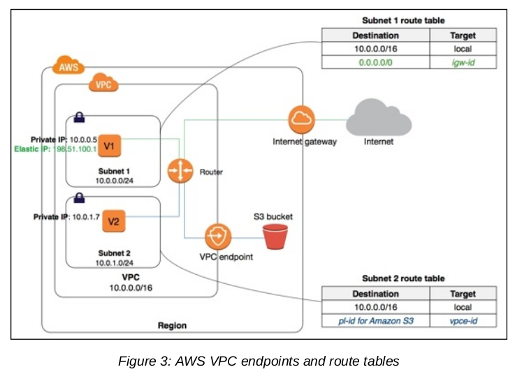
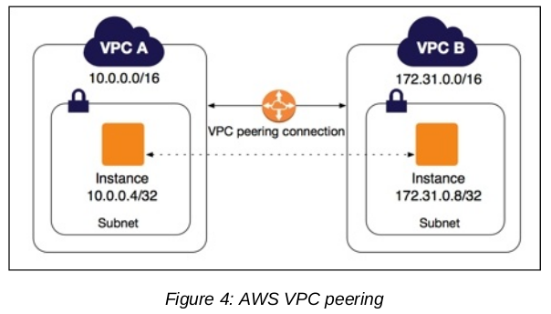

# Security AWS

## VPC
- is a logically separated, isolated and secure private network on the cloud
- is a core component of network services on AWS
- consists of subnets, route tables, ACL, security groups, gateways, vpc flow logs
- VPC features and benefits such as simplicity, security, multiple connectivity options

### Use case of VPC
- Hosting a public-facing website
- Hostinig multi-titer web apps
- Extending corporate network on the cloud
- Disaster recovery

### Subnets
- is used to logically separate resources inside a region
- can either be a private subnet or public subnet
- By default, all subnets of a VPC can route to each other using private IP addresses

### Elastic network interfaces (ENI)
- The ENI are available for EC2 instances running inside a VPC
- Attributes: IPv4, IPv6, MAC address, one or many security groups, ...
- By default, every VPC has a NIC attached to every instance, it known as eth0
- Secondary ENI attached to instances running network and security appliances, such as NAT, LB, ...

### Route tables
- is used to route the traffic to target place
- A route table has rules or routes defined for the flow of traffic 
- decide what data stays inside of VPC and what data should go outside of VPC => define data flow for a VPC

### Internet gateway
- allow communication between resources and internet 
- It is highly available, redundant and horizontally scalable
- serves as a target for route table for all the traffic go out internet

### Elastic IP address
- is a public IPv4, static address that can be associated with any one instance or NIC 

### VPC endpoints
- is a secure way to communicate with other AWS services without using the internet, Direct Connect, VPN Connection, or a NAT device => internal network

### Network Address Translation (NAT)
- is used to allow resources in private subnet to connect with either the internet or other AWS services securely
- NAT devices support only IPv4 traffic

### VPC Peering
- You can connect your VPC with one or many VPCs in the sam region through the VPC Peering option
- Should different about CIDR block of both 2 VPC

## VPC security
- VPC provide multiple features for securing your VPC and securing resources inside your VPC, such as security groups, ACL, VPC flow logs => increase security and monitor your VPC 
- Security features also align security controls with the application requirement of scalability, availability and performance

### Security group
- It is a virtual firewall to control ingress and egress traffic at the resource level 
- Security groups are stateless. These rules are editable and are applied immediately 
- You can add, modify or delete a security group, an ENI can be associated with up to five security groups, while a security group can be associated with multiple resource

### Network access control list (NACL)
- It is an another virtual firewall to configure inbound and outbound traffic for your subnets inside a VPC
- All resources within this subnet are going to use the same configuration for inbound and outbound traffic
- Each subnet can be attached to only one NACL

### VPC flow logs
- It is important to monitor the flow of traffic