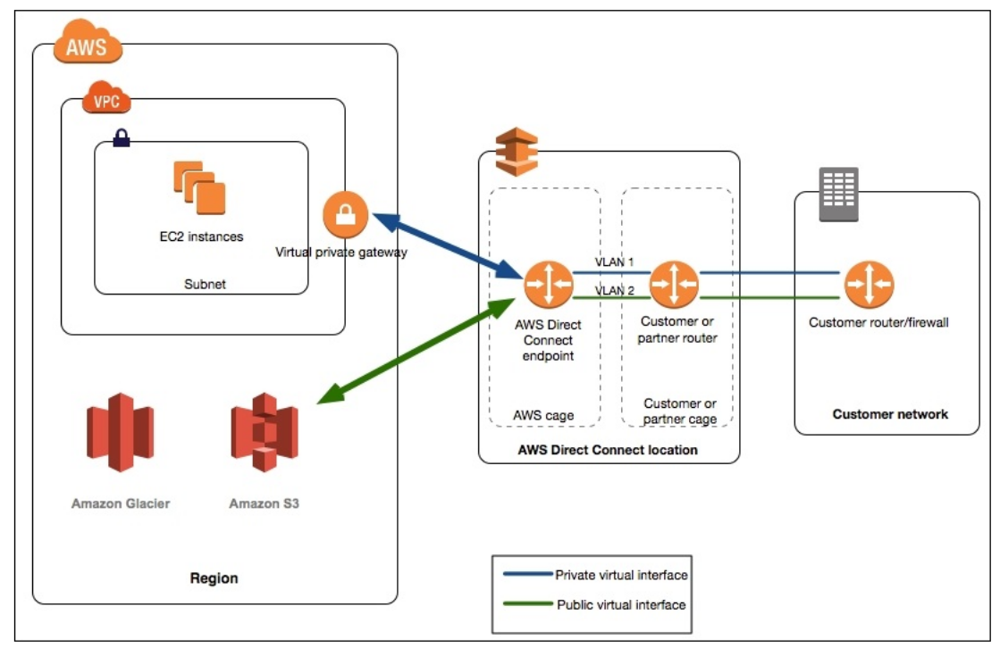
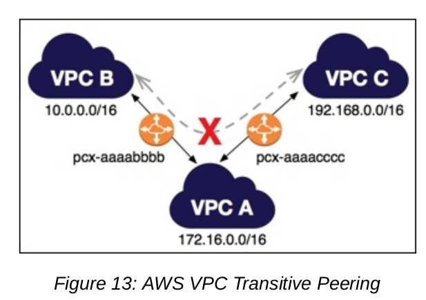
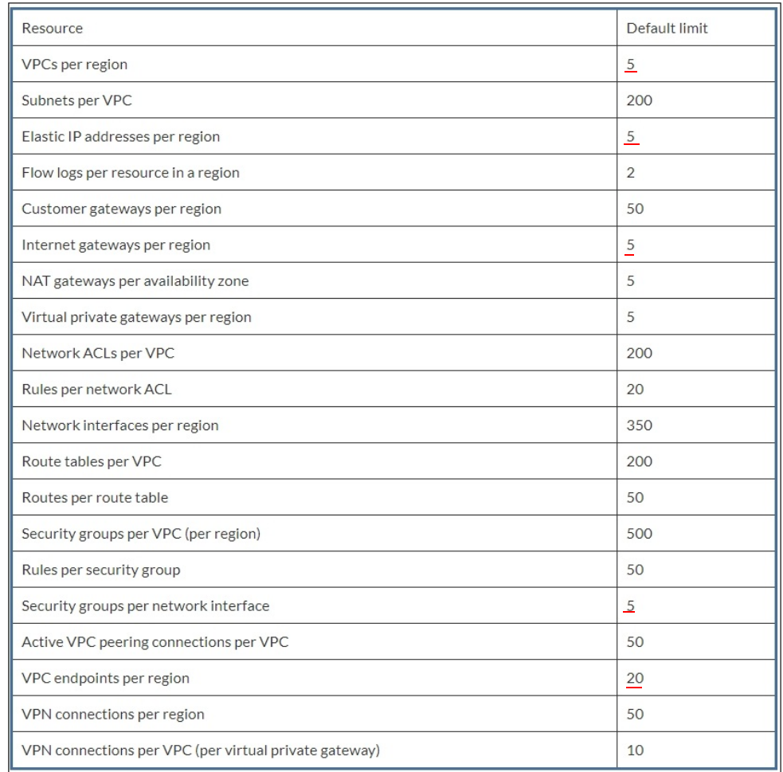
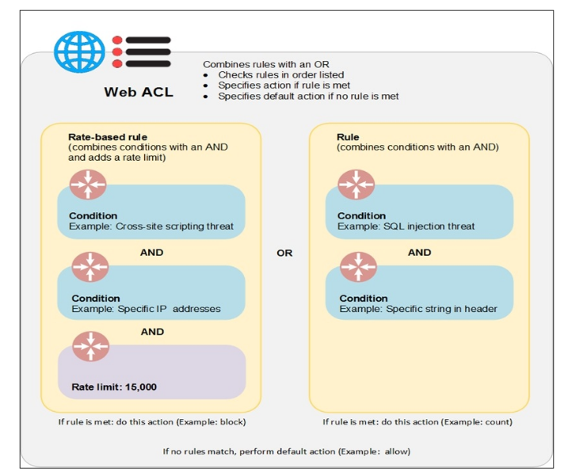

# Security AWS

## VPC
- is a logically separated, isolated and secure private network on the cloud
- is a core component of network services on AWS
- consists of subnets, route tables, ACL, security groups, gateways, vpc flow logs
- VPC features and benefits such as simplicity, security, multiple connectivity options

### Use case of VPC
- Hosting a public-facing website
- Hostinig multi-titer web apps
- Extending corporate network on the cloud
- Disaster recovery

### Subnets
- is used to logically separate resources inside a region
- can either be a private subnet or public subnet
- By default, all subnets of a VPC can route to each other using private IP addresses

### Elastic network interfaces (ENI)
- The ENI are available for EC2 instances running inside a VPC
- Attributes: IPv4, IPv6, MAC address, one or many security groups, ...
- By default, every VPC has a NIC attached to every instance, it known as eth0
- Secondary ENI attached to instances running network and security appliances, such as NAT, LB, ...

### Route tables
- is used to route the traffic to target place
- A route table has rules or routes defined for the flow of traffic 
- decide what data stays inside of VPC and what data should go outside of VPC => define data flow for a VPC

### Internet gateway
- allow communication between resources and internet 
- It is highly available, redundant and horizontally scalable
- serves as a target for route table for all the traffic go out internet

### Elastic IP address
- is a public IPv4, static address that can be associated with any one instance or NIC 

### VPC endpoints
- is a secure way to communicate with other AWS services without using the internet, Direct Connect, VPN Connection, or a NAT device => internal network

### Network Address Translation (NAT)
- is used to allow resources in private subnet to connect with either the internet or other AWS services securely
- NAT devices support only IPv4 traffic

### VPC Peering
- You can connect your VPC with one or many VPCs in the sam region through the VPC Peering option
- Should different about CIDR block of both 2 VPC

## VPC security
- VPC provide multiple features for securing your VPC and securing resources inside your VPC, such as security groups, ACL, VPC flow logs => increase security and monitor your VPC 
- Security features also align security controls with the application requirement of scalability, availability and performance

### Security group
- It is a virtual firewall to control ingress and egress traffic at the resource level 
- Security groups are stateless. These rules are editable and are applied immediately 
- You can add, modify or delete a security group, an ENI can be associated with up to five security groups, while a security group can be associated with multiple resource

### Network access control list (NACL)
- It is an another virtual firewall to configure inbound and outbound traffic for your subnets inside a VPC
- All resources within this subnet are going to use the same configuration for inbound and outbound traffic
- Each subnet can be attached to only one NACL

### VPC flow logs
- It is important to monitor the flow of traffic
- You can create a flow log for your VPC as well as a subnet and a network interface based on your requirement
- You will need the Amazon Resource Name (ARN) of an IAM role that will be used to publish this flow log to CloudWatch logs group.
- VPC flow logs have certain limitations:
    - Not create VPC flow logs for peered VPCs
    - Can't be tagged
    - Can't be modified after it is created
    - Can't capture all types of traffic, such as traffic generated by instances for getting instance metadata

## VPC Access control
- All AWS services require permission to access their resources
- You need to grant appropriate permissions to all users, applications and AWS services to access all VPC resources
- Such as managing a VPC, a read-only permission for VPC, or managing a specific resource for VPC like security group, network ACL

## VPC connectivity options
### Connecting the user network to AWS VPC
- You can connect your netowrk with AWS VPC securely in the following ways:
    - HardwareVPN: using VPC gateways to access AWS VPC over an industry standard, encrypted IPSec hardware VPC connection
    - Direct connect: connect your AWS VPC to your remote network using a dedicated network connection. You can bypass the internet and connect directly to your resources in AWS
    
    - AWS VPN CloudHub: you might have multiple remote networks that need to connect securely with AWS VPC
    - SoftwareVPN

### Connecting AWS VPC with another AWS VPC
- Only works if your VPCs do haven't overlapping IP ranges and have a unique CIDR block
- Using peering VPC, software VPN, hardward VPN, AWS direct connect, ...

### Connecting the internal user with AWS VPC

## VPC limitation

## VPC best practice
- Plan your VPC before your create it
- Choose the highest CIDR block (x.x.0.0/16)
- Unique IP address range
- Shouldn't use default VPC
- Design for region expansion
- Tier your subnets
- Least privilege principle
- Keep most resources in the private subnet
- Create VPCs for different use cases
- Favor security groups over NACLs
- IAM your VPC
- Using VPC peering
- Using Elastic IP instead of public IP
- Tagging in VPC
- Monitoring a VPC

## Data security in AWS
- Consists of 2 catagories:
    - Protecting data at rest
    - Protecting data in transit
- Have multiple solutions:
    - Data encryption
    - Key management services (KMS) for creating and controlling keys used for data encryption
    - Access control
    - AWS service security features

## Security applications 
- AWS cognito: for authenticating user data for your mobile and web apps
    - Providing in-built sign-in screens and authentication functionality
    - It handles authentication, authorization and sync for user management process across devices for all the users
    - 3rd party with google, twitter, facebook, ...
- AWS API gatewate: for securing, creating and managing APIs 
    - Management of APIs includes access control, traffic, monitoring, API version
- AWS WAF: is a web application firewall that helps you define multiple rules and access control lists to secure your web apps from common security threats such as: XSS, DDoS, SQL injections, ...

