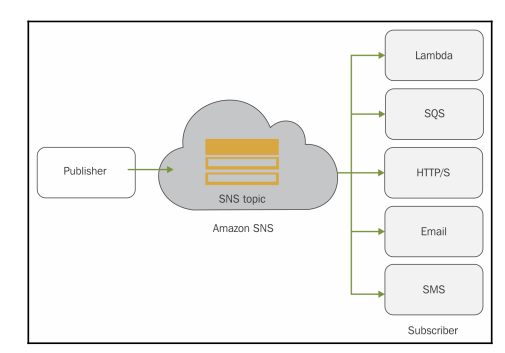

# Simple notification service (SNS)
## Work as server push, mesasge is inited by the publisher and SNS delives the same to the subscribers 

## SNS fan-out
- SQS and SNS are key services to create loosely coupled, scalable and serverless application in the cloud. Fan-out pattern
- The SNS topic sends notifications in parallel to all subscriber SQS queues

- Use case: mobile push notifications, push email and text messaging 