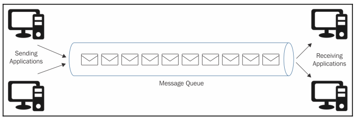
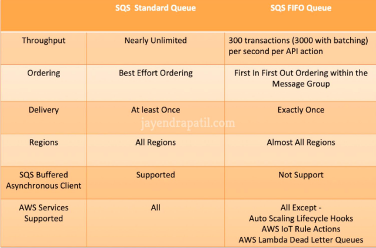
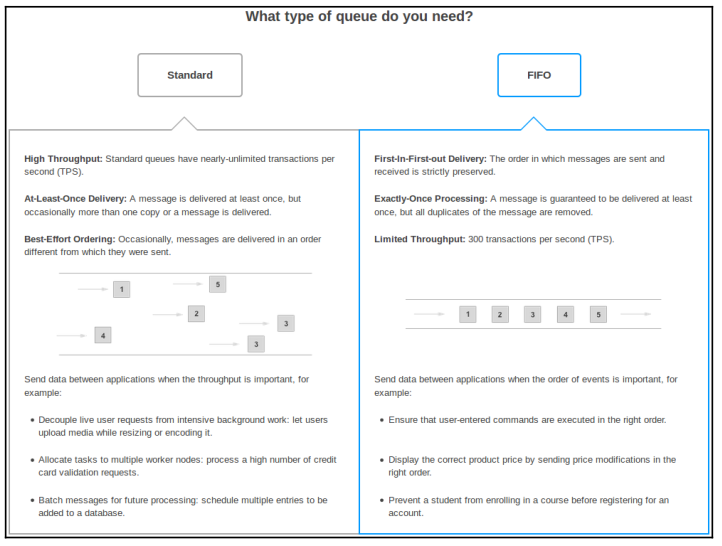
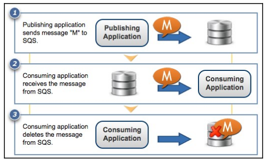

# Simple Queue Service (SQS)
- Message queue is a queue of messages exchanged between applications 
- SQS is a highly reliable, scalable and distributed message queuing service => messaging platform

## Types of queue
- Standard queue:
    - provide best-effort ordering which ensures that messages are deliveried in the same order as they are sent. Occasionally, more than one copy of a message might be deliveried out of order because highly-distributed architecutre wich high throughput
- FIFO queue:
    - offer FIFO delivery and exactly-once processing
    - remains available until a consumer processes and deletes it 

## Dead letter queue
- is used by other queues for storing failed messages that are not successfully consumed by consumer process
- Queue attributes that defines the behavior of a queue:
    - 

## Main features of SQS
- Redundant infrastructure: it ensures that a message is deliveried
    - At least once in a standard queue 
    - Exactly once in a First In First Out queue
- Multiple producers and consumers 
- Configure each queue independently 
- Variable message size:
    - Message size of maximum 256KB
    - If > 256KB => store S3, SQS holds the pointer to the S3 object in the queue
- Queue access control, set a delay time in a queue 

## Use case:
- Decoupling application processes
- Application scalability   
- Guaranteed message delivery with configuration of message queue such as: using only once 
- Asynchronous data processing
- Building ressilience in the system 

## How queues work ?

