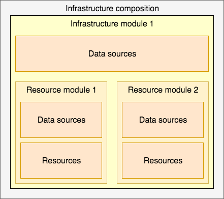

# Terraform in detail

## Terraform design pattern
- [The Terrafile](http://bensnape.com/2016/01/14/terraform-design-patterns-the-terrafile/)

## Note:
- Resource are like atoms in the infrastructure
- Resource modules are molecules
- Module is a smallest versioned and sharable unit (consist of: list of arguments, implement basic logic)
    - Example: terraform-aws-security-group create aws_security_group and aws_security_group_list resources 
    - Access data across molecules (resource module and infrastructure module) is performed using (module) outputs and data source
    - Access between compositions is performed using remote state data sources
```text
composition-1 {
  infrastructure-module-1 {
    data-source-1 => d1

    resource-module-1 {
      data-source-2 => d2
      resource-1 (d1, d2)
      resource-2 (d2)
    }

    resource-module-2 {
      data-source-3 => d3
      resource-3 (d1, d3)
      resource-4 (d3)
    }
  }

}
```
## Concepts
- Resource: such as: aws_vpc, aws_instance, aws_db_instance
    - Belong to provider such as: aws, gcp, azure, ...
    - Accepts arguments, output attributes, has lifecycle
    - Can created, retrieved, updated and deleted
- Resource module: is a collection of connected resources which together perform the common action 
    - Example: AWS VPC module to create VPC, subnet, NAT gateway, ...
- Infrastructure module: is a collection of resource modules, which is serving same purpose
    - Example: terraform-aws-atlantis use resource modules like terraform-aws-vpc, terraform-aws-group to create and running Atlantis on AWS Fargate
- Composition: is a collection of infrastructure module, which can span cross several logically separated areas (AWS regions, several AWS accounts)
    - Is used to describe complete infrastructure required for the whole project
    
    - Data source performs read-only operation 
        - Is dependant on provider configuration
        - Is used in a resource module and an infrastructure module
        - Example: terraform_remote_state act as a glue for higher level modules and composition
        
## Terraform source code structure
- Basic component consist fo 3 files:
```text
- main.tf       : call modules, locals and data-sources to create all resources
- variables.tf  : contains declarations of variables used in main.tf
- outputs.tf    : cotains outputs from resources created in main.tf
Optional, terraform.tfvars : only should use at composition level
```

## Practise
- [Create VPC with 1 account and 1 environment](https://github.com/antonbabenko/terraform-best-practices/tree/master/examples/small-terraform)
- [Create VPC with 2 account and 2 environment (staging and production)](https://github.com/antonbabenko/terraform-best-practices/tree/master/examples/medium-terraform)
- [Create VPC with 2 account and 2 environment and 2 region](https://github.com/antonbabenko/terraform-best-practices/tree/master/examples/large-terraform)

## Naming convention
- Using _ (underscore) in all: resource names, data source names, variable names, outputs
- Using - (dash) for values. Example id, dns-name, ...
- Only use lowercase letters and number
- Define resource with format: resource "aws_route_table" "public" { ... }
- Inverted conditions with: 1 - boolean value
    - For example: count = "${1 - var.create_public_subnets}"
- Condition: count = "${length(var.public_subnets) > 0 ? 1: 0})"
- Type:
    - type = "list" => default = []
    - type = "map"  => default = {}
- Name of the outputs is important to make them consistent and understandable outside of its scope
    - Good structure: {name}_{type}_{attribute} 
        - {name} is a resource or data source, such as: aws_subnet is subnet, aws_vpc is vpc
        - {type} is a type of a resource 
        - {attribute} is an attribute returned by the output
    - Return ID of security group
    ```text
    output "this_security_group_id" {
      description = "The ID of the security group"
      value       = "${element(concat(coalescelist(aws_security_group.this.*.id, aws_security_group.this_name_prefix.*.id), list("")), 0)}"
    }
    ```
    - Use plural name if the returning value is a list
    ```text
    output "this_rds_cluster_instance_endpoints" {
      description = "A list of all cluster instance endpoints"
      value       = ["${aws_rds_cluster_instance.this.*.endpoint}"]
    }
    ```
    - Condition in output
    ```text
    output "this_db_instance_id" {
      description = "The RDS instance ID"
      value       = "${element(concat(coalescelist(aws_db_instance.this_mssql.*.id, aws_db_instance.this.*.id), list("")), 0)}"
    }
    ```