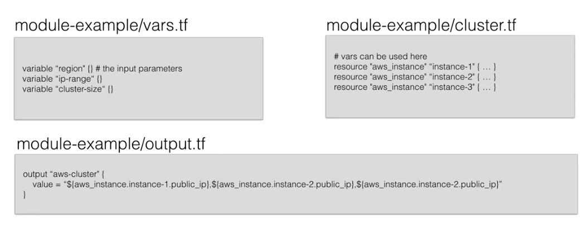
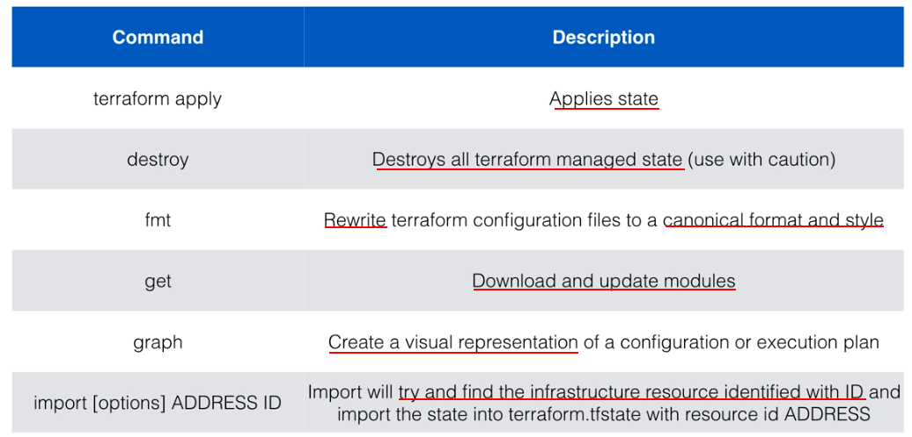
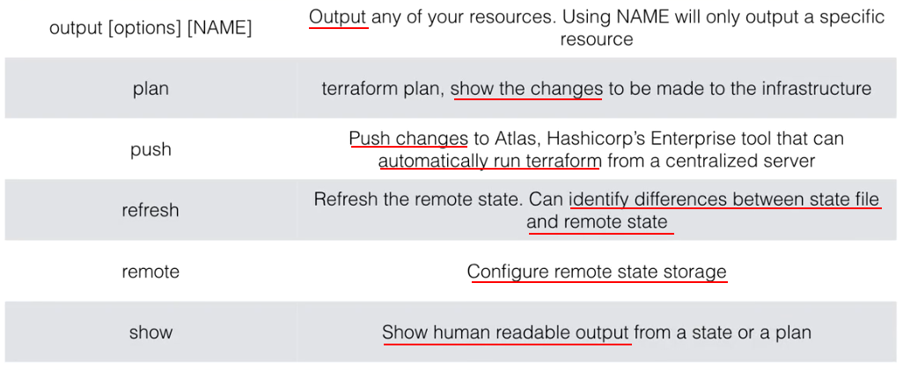

# Terraform structure


## Main structure
- provider.tf
```text
provider "aws" {
    access_key = "${var.AWS_ACCESS_KEY}"
    secret_key = "${var.AWS_SECRET_KEY}"
    region = "${var.AWS_REGION}"
}
```

- vars.tf
```text
variable "AWS_ACCESS_KEY" {}
variable "AWS_SECRET_KEY" {}
variable "AWS_REGION" {
    default = "us-east-1"
}
variable "AMIS" {
    type = "map"
    default = {
        us-east-1 = "ami-..."
        us-east-2 = "ami-..."
        us-east-3 = "ami-..."
    }
}
```

- terraform.tfvars -> in .gitignore
```text
AWS_ACCESS_KEY = "abcd"
AWS_SECRET_KEY = "abcd"
AWS_REGION = "ap-southeast-1"
```

- instance.tf 
```text
resource "aws_instance" "example" {
    ami = "ami-028a5cff2f5a0f6c3"
    instance_type = "t2.micro"
}
```
or
```text
resource "aws_instance" "example" {
    ami = "${lookup(var.AMIS, var.AWS_REGION)}"
    instance_type = "t2.micro"
}
```

## Provision software
- instance.tf
```text
resource "aws_key_pair" "mykey" {
    key_name = "mykey"
    public_key = "${file("${var.PATH_TO_PUBLIC_KEY}")}"
}

resource "aws_instance" "example" {
    ami = "${lookup(var.AMIS, var.AWS_REGION)}"
    instance_type = "t2.micro"
    key_name = "${aws_key_pair.mykey.key_name}"

    provisioner "file" {
        source = "script.sh"
        destination = "/tmp/script.sh"
    }
    provisioner "remote-exec" {
        inline = {
            "chmod +x /tmp/script.sh",
            "sudo /tmp/script.sh"
        }
    }
    connection {
        user = "${var.INSTANCE_NAME}"
        private_key = "${file("${var.PATH_TO_PRIVATE_KEY}")}"
    }
}
```
- vars.tf
```text
...
variable "PATH_TO_PRIVATE_KEY" {
    default = "mykey"
}
variable "PATH_TO_PUBLIC_KEY" {
    default = "mykey.pub"
}
variable "INSTANCE_USERNAME" {
    default = "ubuntu"
}
```

## Output
- use "output" to display the public IP address of an AWS resource
    - The resource type: aws_instance
    - The resource name: example
    - The attribute name: public_ip
```text
resource "aws_instance" "example" {
    ami = "${lookup(var.AMIS, var.AWS_REGION)}"
    instance_type = "t2.micro"
}

output "ip" {
    value = "${aws_instance.example.public_ip}"
}
// -------------------
Outputs

ip = 52.212.28.166
```
- main.rf
    - you can also use the attributes in a script
```text
...
resource "aws_instance" "example" {
    ami = "${lookup(var.AMIS, var.AWS_REGION)}"
    instance_type = "t2.micro"
    provisioner "local-exec" {
        command = "echo ${aws_instance.example.private_ip} >> private_ips.txt"
    }
}
```

## Terraform keeps the remote state of infrastructure 
- save at a file called terraform.tfstate
- previous state in terraform.tfstate.backup
- when execute applay command, create a new terraform.tfstate, and backup is written 
- If remote state changes and you hit terraform apply agains, terraform will make changes to meet the correct remote state again 
- Keep the terraform.tfstate in version control such as: git

## Data source
- provide you with dynamic information
- expose information using data source
- For example: 
    - List of AMIs
    - List of availability zone 
    - Filter traffic based on an AWS region
```text
data "aws_ip_ranges" "european_ec2" {
    regions = ["eu-west-1","eu-central-1"]
    services = ["ec2"]
}

resource "aws_security_group" "from_european" {
    name = "from_european"
    ingress {
        from_port = "443"
        to_port = "443"
        protocol = "tcp"
        cidr_blocks = ["${data.aws_ip_ranges.european_ec2.cidr_blocks}"]
    }
    tags {
        CreateDate = "${data.aws_ip_ranges.european_ec2.create_date}"
        SyncToken = "${data.aws_ip_ranges.european_ec2.sync_token}"
    }
}
```

## Template provider
- can help creating customized configuration files
- can build templates based on variables from terraform resource attributes (such as: public ip address, private ip address)
- The result is a string that can be used as a variable in terraform
    - The string contains a template
    - Such as: a configuration file => used to create a generic template or clout init config
- In aws, using "user-data" to pass commands when instance starts for the first time
- Create template file
```text
#!/bin/bash
echo "database-ip = ${myip}" >> /etc/myapp.config 
```
- Create template resource to read the template file and replace ${myip}
```text
data "template_file" "my-template" {
    template = "${file("templates/init.tpl")}"
    
    vars {
        myip = "${aws_instance.database1.private_ip}"
    }
}
```
- Then you can use the my-template resource when creating a new instance
```text
resource "aws_instance" "web" {
    ...
    user_data = "${data.template_file.my-template.rendered}"
}
```

## Module
- you can use modules to make your terraform more organized
- using third party modules, such as modules from github
- reuse parts of your code, such as custom vpc, ...
- Using a module from git
```text
module "module-example" {
    source = "github.com/thanhgit/vpc"
}
```
- Using a module from a local folder
```text
module "module-example" {
    source = "./module-example"
}
```
- Pass arguments to the module
```text
module "module-example" {
    source = "./module-example"
    region = "ap-southeast-1"
    ip-range = "10.0.0.0/8"
    cluster-size = 3
}
```
- Example

```text
output "some-output" {
    value = "${module.module-example.aws-cluster}"
}
// -> you can use the variables anywhere in the terraform code
```

## Terraform command




